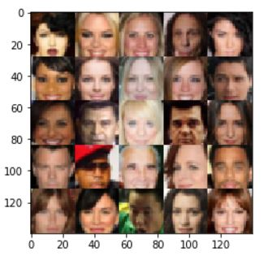
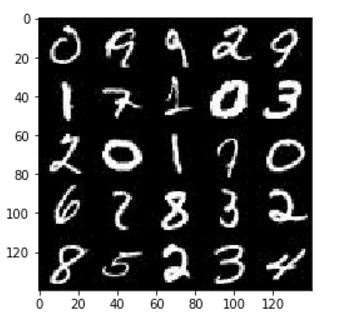

## Translate a Language
Language: Python (NumPy, TensorFlow)  
Built and trained Generative Adversarial Networks on the CelebA and MNIST dataset to generate new images of faces and digits.
 

  

 

  

